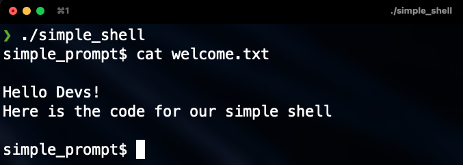

# Simple Shell 🐚


## Description

Here is the base code for the project/tutorial that I made on how to create a shell using the C programming language. I invite you to follow the link to carry out the project step by step and improve your knowledge of C.

https://medium.com/@santiagobedoa/coding-a-shell-using-c-1ea939f10e7e

## Files

| Name | Description |
| ------------------------------ | -------------------------------------------- |
| shell.h | Header file program. |
| main.c | Main function, interactive and non-interactive. |
| new_procees.c | Function that creates a new process. |
| own_cd.c | Change the working directory. |
| own_env.c | Function that prints environment variables. |
| own_exit.c | Exit shell with a given state. |
| own_help.c | Function that prints help (get information about a command) |
| read_line.c | Read a line from stdin. |
| read_stream.c | Read a line from the stream. |
| shell_interactive.c | Run shell interactive mode. |
| shell_no_interactive.c | Run shell non-interactive mode. |
| split_line.c | Split a string into tokens. |
| execute_args.c | Number of builtin functions. |

## List of functions and system calls.

* ```chdir``` (man 2 chdir)
* ```exit``` (man 3 exit)
* ```fork``` (man 2 fork)
* ```free``` (man 3 free)
* ```getline``` (man 3 getline)
* ```isatty``` (man 3 isatty)
* ```malloc``` (man 3 malloc)
* ```perror``` (man 3 perror)
* ```strtok``` (man 3 strtok)
* ```waitpid``` (man 2 waitpid)

## Install

Clone this repo and compile as follow:

> gcc -Wall -Werror -Wextra -pedantic -std=gnu89 *.c -o hsh

## Usage

Interactive mode: ```./hsh```

Non-interactive mode: ```echo "/bin/ls" | ./hsh```

### Built-ins

* [x] ```cd```
* [x] ```env```
* [x] ```help```
* [x] ```exit```
* [ ] ```setenv```
* [ ] ```unsetenv```

### Examples

* **Run shell in interactive mode:**

```
 $ ./hsh
 simple_prompt$ ls -l
 total 72
-rw-r--r-- 1 root root   771 Nov 16 12:01 execute_args.c
-rwxr-xr-x 1 root root 20192 Nov 16 12:31 hsh
-rw-r--r-- 1 root root   307 Nov 16 08:39 main.c
-rw-r--r-- 1 root root   646 Nov 16 11:59 new_process.c
-rw-r--r-- 1 root root   384 Nov 16 12:28 own_cd.c
-rw-r--r-- 1 root root   338 Nov 16 12:28 own_env.c
-rw-r--r-- 1 root root   284 Nov 16 12:29 own_exit.c
-rw-r--r-- 1 root root   591 Nov 16 12:31 own_help.c
-rw-r--r-- 1 root root   590 Nov 16 09:13 read_line.c
-rw-r--r-- 1 root root   815 Nov 16 12:26 read_stream.c
-rw-r--r-- 1 root root   677 Nov 16 12:27 shell.h
-rw-r--r-- 1 root root   516 Nov 16 08:38 shell_interactive.c
-rw-r--r-- 1 root root   442 Nov 16 12:07 shell_no_interactive.c
-rw-r--r-- 1 root root   848 Nov 16 09:35 split_line.c
```
```
 $ /hsh
 simple_prompt$ echo “Hello, World!”
 “Hello, World!”
```
* **Run shell in non-interactive mode:**

```
 $ echo "/bin/ls" | ./hsh
 execute_args.c  new_process.c  own_exit.c   read_stream.c        shell_no_interactive.c
hsh             own_cd.c       own_help.c   shell.h              split_line.c
main.c          own_env.c      read_line.c  shell_interactive.c
```

<p>&nbsp</p>

<h3 align="left">Connect with me:</h3>
<p align="left">
<a href="https://www.linkedin.com/in/santiagobedoa/" target="blank"></a>
<a href="https://twitter.com/santiagobedoa" target="blank"></a>
<a href="https://medium.com/@santiagobedoa" target="blank"></a>
</p>
<p></p>
